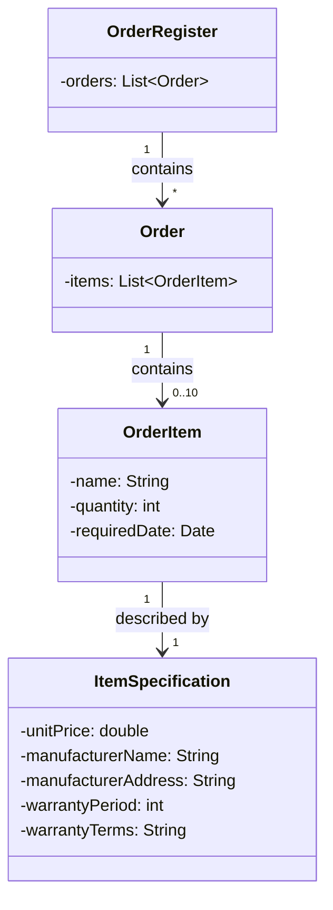
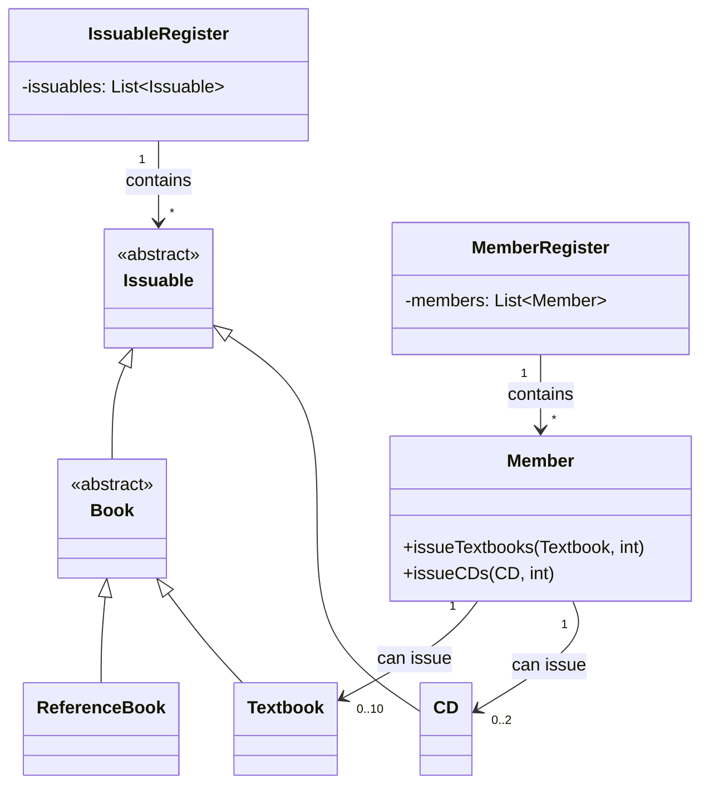
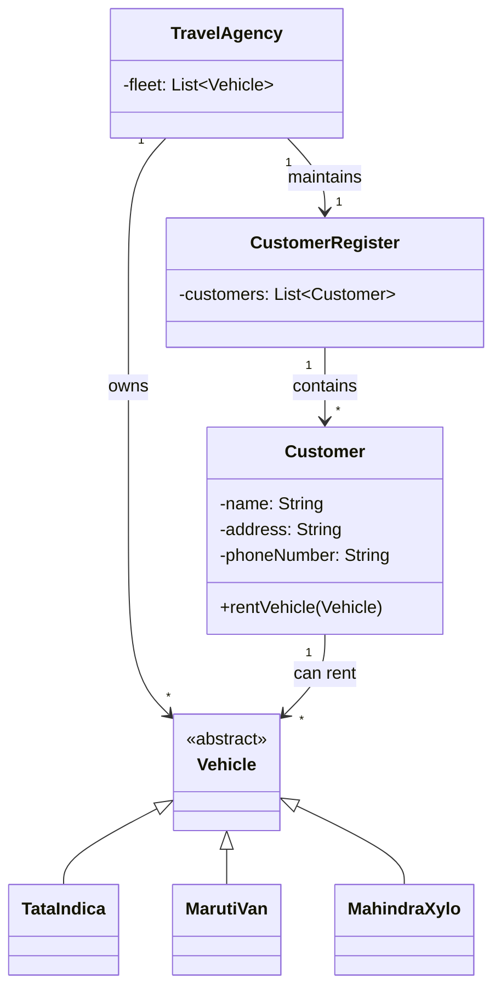
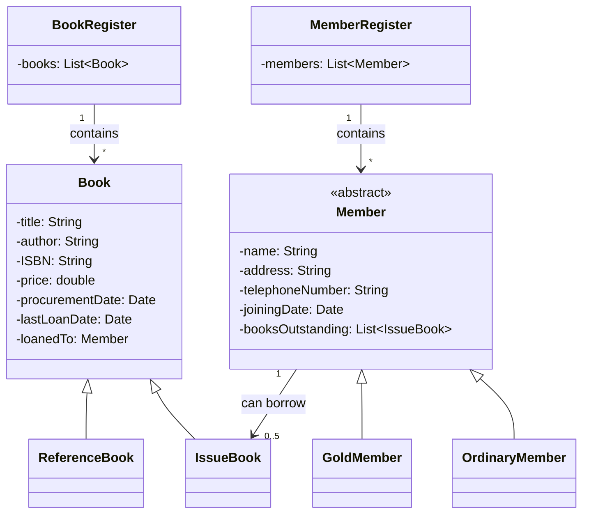
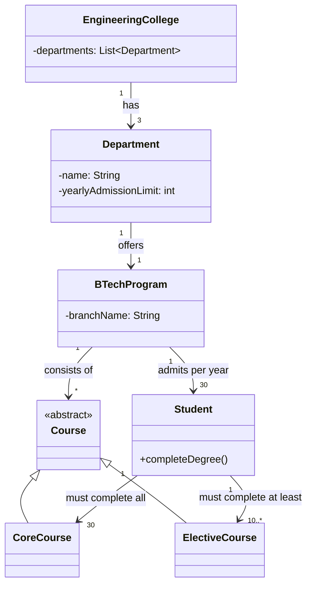
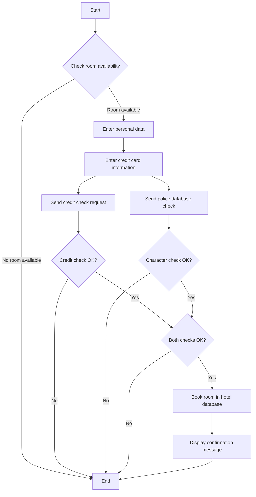
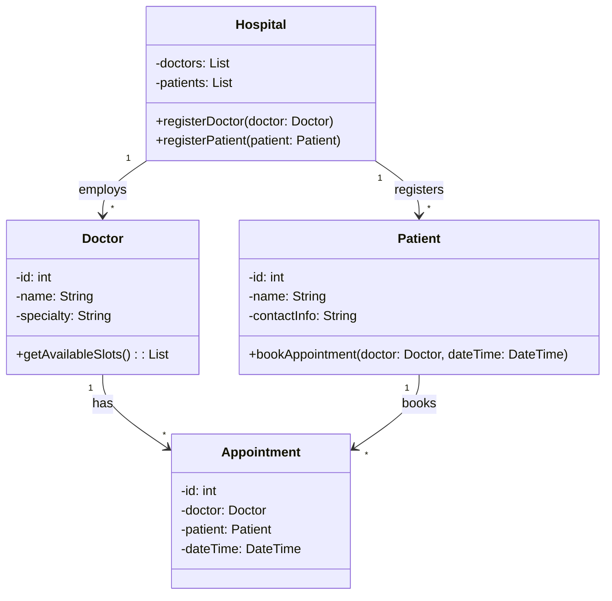

  **1. With the help of a suitable example explain how the inheritance feature of the Object oriented paradigm helps in code reuse.**

**Concept:** Inheritance allows classes to inherit attributes and methods from a base class, promoting code reuse. This avoids redundancy by defining common features in one place (the base class) and sharing them with multiple derived classes.

**Example:**

Consider a simplified library management system where different types of library members (Faculty, Student, and Staff) need to handle common data and operations.
![[Pasted image 20240912102128.png]]


**2. Can association relationship among classes be unary? If your answer is “yes”, give an example of a unary association among classes.**

**Answer:** Yes, an association relationship among classes can be unary. This is also known as a recursive association or unary association. For example, consider a `Student` class where students can be friends with other students. This relationship can be represented as a unary association within the `Student` class, indicating that one student can be associated with other students through a friendship relationship. In a diagram, this would show a single class with a looped arrow pointing back to itself, illustrating that the relationship is within the same class.

**3. Is a class an abstract data type (ADT)? Justify your answer.**

**Answer:** Yes, a class can be considered an abstract data type (ADT). Here's the justification:

1. Abstract data:
   - In a class, data (attributes) is typically encapsulated and accessed only through methods.
   - The internal representation of data is hidden from other objects, fulfilling the "abstract data" requirement of an ADT.

2. Data type characteristics:
   - Representation: Classes define how data is stored for their objects.
   - Value space: Classes determine the possible values their objects can have.
   - Behavior: Classes specify the operations (methods) that can be performed on their objects.

3. Instantiation:
   - Like ADTs, classes can be instantiated to create objects (variables of that type).

4. Implementation flexibility:
   - Classes allow changing internal data storage without affecting the external interface, a key ADT feature.

However, it's worth noting that while all classes are ADTs, not all ADTs are necessarily classes. Classes in object-oriented programming typically include additional features like inheritance and polymorphism, which are not required for something to be considered an ADT.

In summary, a class fulfills the core requirements of an ADT by providing data abstraction and defining a data type with specific behavior, while also offering the additional benefits of object-oriented programming.


**4 Examples of relations among classes:**

**(a) Single inheritance:**  
- **Class Diagram:**  
  ```
  Vehicle → Car
  ```  
  - **Explanation:** A `Car` class inherits from the `Vehicle` class, gaining its properties like speed and methods like move.

---

**(b) Multiple inheritance:**  
- **Class Diagram:**  
  ```
  Athlete ← Swimmer → Runner
  ```  
  - **Explanation:** The `Swimmer` class inherits from both the `Athlete` and `Runner` classes, combining attributes from both.

---

**(c) Association:**  
- **Class Diagram:**  
  ```
  Student ↔ Course
  ```  
  - **Explanation:** A `Student` can enroll in a `Course`, and a `Course` can have multiple `Students`.

---

**(d) Aggregation:**  
- **Class Diagram:**  
  ```
  Library → Book
  ```  
  - **Explanation:** A `Library` is an aggregation of multiple `Book` objects. The books can exist independently.

---

**(e) Dependency:**  
- **Class Diagram:**  
  ```
  Customer → Order
  ```  
  - **Explanation:** The `Customer` class depends on the `Order` class, as creating a customer may involve placing an order.


**5. UML Class Diagrams for given sentences:**

**(a) A square is a polygon:**  
- **Class Diagram:**  
  ```
  Polygon → Square
  ```  
  - **Explanation:** `Square` is a subclass of `Polygon` through inheritance.

---

**(b) Shyam is a student:**  
- **Class Diagram:**  
  ```
  Student ← Shyam
  ```  
  - **Explanation:** `Shyam` is an instance of the `Student` class.

---

**(c) Every student has a name:**  
- **Class Diagram:**  
  ```
  Student - name
  ```  
  - **Explanation:** `Student` class has an attribute `name`.

---

**(d) 100 paisa is one rupee:**  
- **Class Diagram:**  
  ```
  Rupee → Paisa (1:100)
  ```  
  - **Explanation:** `100 Paisa` are associated with `1 Rupee`.

---

**(e) Students live in hostels:**  
- **Class Diagram:**  
  ```
  Student → Hostel
  ```  
  - **Explanation:** Association between `Student` and `Hostel` where students live in hostels.

---

**(f) Every student is a member of the library:**  
- **Class Diagram:**  
  ```
  Student → Library
  ```  
  - **Explanation:** Association between `Student` and `Library` where each student is a member.

---

**(g) A student can renew his borrowed books:**  
- **Class Diagram:**  
  ```
  Student → Book
  ```  
  - **Explanation:** Association where `Student` can renew `Book`.

---

**(h) A college has many students:**  
- **Class Diagram:**  
  ```
  College → Student (1:*)
  ```  
  - **Explanation:** Aggregation showing that a `College` has multiple `Students`.

---

**(i) A linked list consists of many nodes such that each node is a successor of some node and is the predecessor of some node:**  
- **Class Diagram:**  
  ```
  Node → Node (1:1) Successor
  Node → Node (1:1) Predecessor
  ```  
  - **Explanation:** A `Node` in the linked list has a successor and a predecessor, establishing a bidirectional link.

---

**(j) A library member can borrow up to five books:**  
- **Class Diagram:**  
  ```
  LibraryMember → Book (1:5)
  ```  
  - **Explanation:** A `LibraryMember` can borrow up to 5 `Books`.

![[Pasted image 20240912111449.png]]


**6. Distinction between a Design Model and an Analysis Model:**

1. **Purpose:**
   - **Analysis Model:** Focuses on **what** the system should do, capturing functional and non-functional requirements and specifying the problem domain. It represents the **user’s view** of the system, ensuring all system functionalities are defined.
   - **Design Model:** Concentrates on **how** the system will fulfill the specified requirements, converting the analysis model into an architecture that can be implemented. It reflects the **developer's view** and describes the structure and behavior of the system components.

2. **Level of Abstraction:**
   - **Analysis Model:** Provides a **high-level** view, abstracting details to focus on system requirements, without specifying implementation.
   - **Design Model:** Adds **detailed** structure and defines the system's architecture, components, and interfaces, bridging the gap between the abstract analysis and concrete implementation.

3. **Focus:**
   - **Analysis Model:** Emphasizes the **problem domain** and the user's needs, identifying what the system must achieve functionally.
   - **Design Model:** Focuses on the **solution domain**, defining how the system's components interact and are organized to achieve the system’s objectives.

4. **Artifacts:**
   - **Analysis Model:** Includes artifacts like **use case diagrams**, **activity diagrams**, and **domain models**, which specify the functional aspects of the system.
   - **Design Model:** Includes **class diagrams**, **sequence diagrams**, **component diagrams**, and **deployment diagrams**, detailing how the system will be built.

In summary, the **analysis model** defines the requirements of the system from a user perspective, while the **design model** provides a blueprint for developers to implement the system.

**7. Difference between abstraction and encapsulation**

![[Pasted image 20240912115901.png]]

**5. Distinguish between a modelling language such as UML and a design process. Also
Explain how these two are related.**

It is important to remember that UML is not a system design or development
Methodology by itself, neither is it designed to be tied to any specific methodology. UML
Is merely a language for documenting models. Before the advent of UML, every design
Methodology that existed, not only prescribed its unique
Set of design steps, but each was tied to some specific
Design modelling language. For example, OMT
Methodology had its own design methodology and had
Its own unique set of notations. So was the case with
Booch’s methodology, and so on. This situation made it
Hard for someone familiar with one methodology to
Understand and reuse the design solutions available from
A project that used a different methodology. In general, reuse of design solutions across
Different methodologies was hard. UML was intended to address this problem that was
Inherent to the modelling techniques that existed.
One of the objectives of the developers of UML was to keep the notations of UML
Independent of any specific design methodology, so that it can be used along with any
Specific design methodology. In this respect, UML is different from its predecessors


**9. What are the different system views that can be modelled using UML? What are the
Different UML diagrams which can be used to capture each of the views? Do you
Need to develop all the views of a system using all the modelling diagrams supported
By UML? Justify your answer.**

![[Pasted image 20240912122245.png]]

![[Pasted image 20240912122255.png]]


![[Pasted image 20240912122321.png]]

**raw a class diagram to represent the following: “A patient is a person and has
everal persons as relatives”**

![[Pasted image 20240912124325.png]]


**Draw a class diagram using the UML syntax to represent the following: an**
**OrderRegister consists of many orders. Each order consists of up to ten order items.**
**Each order item contains the name of the item, its quantity and the date by which**
**356 Fundamentals of Software Engineering**
**It is required. Each order item is described by an item specification object having**
**Details of the order item such as its unit price, name and address of the manufacturer,**
**The warranty period, and the terms of warranty**




**Draw a class diagram using the UML syntax to represent following partial description**
**Of a library. An issuable can either be a book or a CD. Books can be either reference**
**Books or textbooks. The details of various issuables are maintained in a register called**
**The issuable register. The library has many members whose details are maintained in**
**A member register. A member can issue upto 10 textbooks for a month. A member**
**Can also issue two CDs for a week.**




**Draw a class diagram using the UML syntax to represent the following: The fleet of**
**Vehicles at a travel agency consists of vehicles of the types Tata Indica, Maruti van,**
**And Mahindra Xylo. The regular customers of the travel agency can rent any vehicle**
**They want. The details of the customers such as the name, address, and phone number**
**Are maintained by the agency in a customer register**




**Draw a class diagram using the UML syntax to represent the following: The book**
**Register of a library contains details of all books in the library. The various details**
**For each book that are maintained includes its title, author, ISBN number, price,**
**Date of procurement, price, and date of last loan, person to whom loaned. A book**
**Can either be a reference or issue type book. The reference books are to be referred**
**Inside the library and cannot be loaned out, whereas issue books can be taken on**
**Loan by a member. A member may either be a gold member or an ordinary member.**
**The member register contains the details of all members of the library. The details**
**That are maintained for a member include member name, address, telephone number,**
**Date of joining library and books outstanding. Each library member can take on loan**
**At most five issue books.**




**Draw a class diagram using the UML syntax to represent the following. An**
**engineering college offers B.Tech degrees in three branches—Electronics, Electrical,**
**and Computer science and engineering. These B.Tech programs are offered by the**
**Respective departments. Each branch can admit 30 students each year. For a student**
**to complete the B.Tech degree, he/she has to clear all the 30 core courses and at least**
**10 of the elective courses**



**Develop the use case model for a typical bank ATM.**

![[Pasted image 20240912130702.png]]


**Develop a UML activity diagram to model the process of booking a room in a hotel**
**As described below.**
**When a customer needs a room on some specific dates, he first checks whether any**
**Suitable room is available in the hotel on those dates. If a room is available, then he**
**Enters his personal data such as telephone number address, etc. He also enters his**
**Credit card information. The system sends a request to the credit card database to**
**Check whether enough credit is available to pay the hotel bills. At the same time a**
**Message is sent out to the police database to check the character of the customer (good**
**Or bad). After getting favourable replies to both the queries, the system proceeds**
**To book the room in the hotel database and displays a confirmation message to the**
**Customer**



**Draw a UML class diagram to model an airport system that is described following.**
**A set of flights operate from each airport. Each flight is identified by its flight**
**number. Each flight is characterised by the aircraft manufacturer (e.g., Boeing or**
**Airbus), aircraft model (e.g., 737, 747, 787, etc.), an origin airport, a destination**
**Airport, scheduled times at the origin and the destination, days of the week in which**
**It operates, and the total number of seats in the flight. A passenger can book a flight**
**For a specific date. Each passenger has a name, a mobile number, and address. A**
**Flight booking is characterised by a transaction number, ticket price, and any special**
**Amenities booked (such as preordered meals).**



